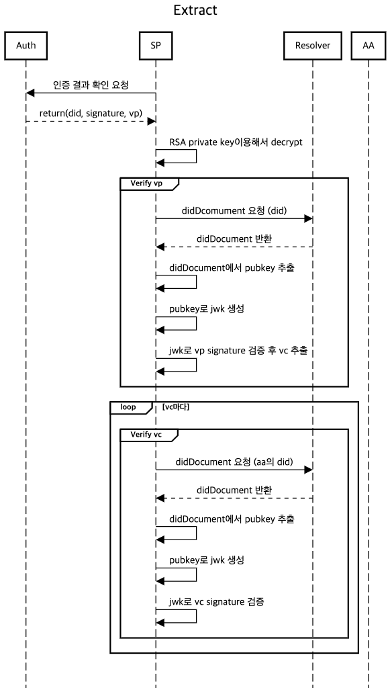
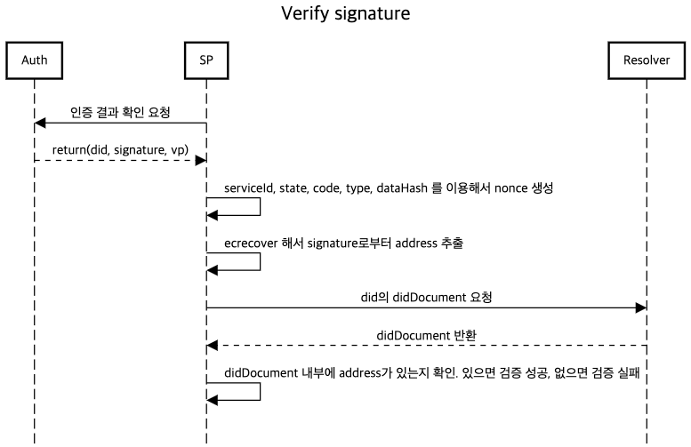

# Method flow
## 개요
mykeepin-verify-sdk 의 각 method의 flow를 정리한 문서입니다.

## 목차
* [extract](##extract)
* [verifySignature](##verifySignature)

## extract
### Flow image

### 설명
Auth 서버에서 받아온 vp를 검증하고 vp 내부의 vc까지 검증하는 메소드입니다. 

## verifySignature

### Flow image

### 설명
먼저 sp의 service id, state, code, type, data hash를 이용해서 nonce를 생성합니다. 이후 nonce와 signature를 ecrecover해서 address를 추출합니다. 이후 did를 이용해서 did document를 리턴 받고 did document 내부에 address가 있는지 확인하여 signature를 검증합니다.